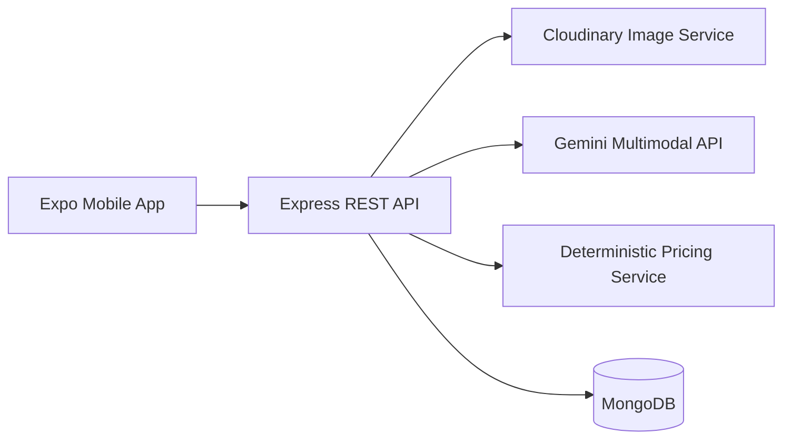

# Artisan AI Business Manager

Production-quality MVP prototype for Smart India Hackathon problem statement 26090: AI-driven market linkage and smart cataloging for marginalized artisans.

## MVP scope

The prototype focuses on one simple workflow:

`Photo -> Improve -> Understand -> Create catalog -> Calculate price -> Review -> Save`

Included features:

- Product image upload and Cloudinary enhancement
- Gemini multimodal catalog generation with validated structured output
- Deterministic, transparent product pricing
- Editable product details and saved product records
- Explicit demo fallback mode when external AI or image services are unavailable

Marketplace, payments, B2B matching, ONDC, voice recognition, authentication, and advanced recommendations are intentionally outside this MVP.

## Repository layout

- `mobile/`: Expo React Native application
- `server/`: Express, TypeScript, MongoDB, Gemini, and Cloudinary API

## Architecture



## Setup

### Backend

1. Copy `server/.env.example` to `server/.env`.
2. Set `MONGODB_URI` and `CLIENT_ORIGIN`. Gemini and Cloudinary values are optional during demo mode.
3. Install and build:

```powershell
npm install --prefix server
npm run build --prefix server
```

4. Start the API:

```powershell
npm run server:dev
```

The health check is available at `GET http://localhost:4000/api/health`.

### Mobile

1. Copy `mobile/.env.example` to `mobile/.env` and set `EXPO_PUBLIC_API_URL`.
2. Install and start Expo:

```powershell
npm install --prefix mobile
npm run mobile:start
```

The mobile app currently includes the home screen and the first create-product step. The provider integration is explicit: when Gemini or Cloudinary credentials are absent, the API returns `demoMode: true` rather than silently claiming a real provider result.

## API endpoints

- `GET /api/health`
- `POST /api/products/image` with multipart field `image`
- `POST /api/products/generate-catalog`
- `POST /api/products/calculate-price`
- `POST /api/products`
- `GET /api/products`
- `GET /api/products/:id`
- `PUT /api/products/:id`
- `DELETE /api/products/:id`

Example pricing request:

```json
{
  "materialCost": 250,
  "labourCost": 150,
  "packagingCost": 30,
  "category": "Handicrafts"
}
```

## Validation

```powershell
npm run test --prefix server
npm run build --prefix server
.\mobile\node_modules\.bin\tsc.cmd --noEmit -p .\mobile\tsconfig.json
```

The server pricing test and strict builds pass. Expo web/native export is not available with the blank SDK 57 template configuration until a platform bundler configuration is added.
